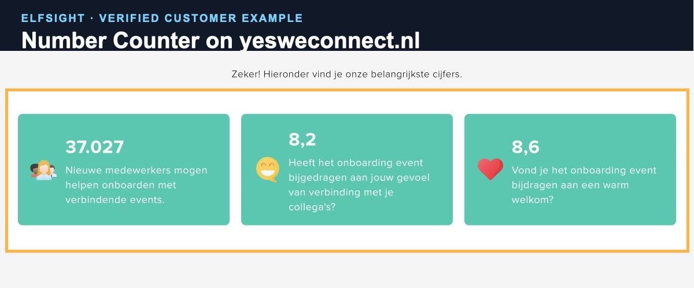
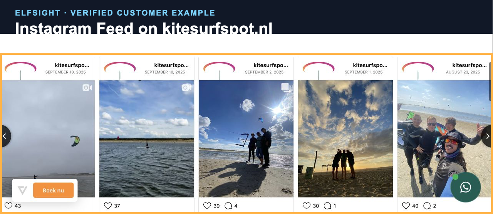
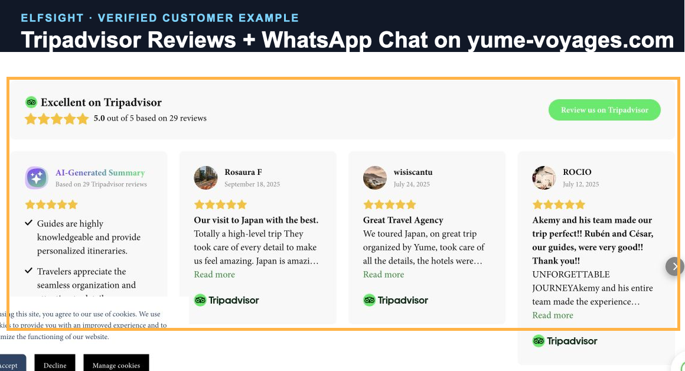

Squarespace widget roundups normally start with the widget catalogue. I started with the websites.

I checked 821 reachable sites supplied by Multilingualizer customers and found Elfsight on 20 installations belonging to 17 customers. I then checked the widget IDs against Elfsight's public boot response so a loader script on its own did not count as an active widget.

The result is a more useful list than “94 widgets you could install”. It shows which widgets multilingual site owners were actually using in August 2026.

**Affiliate disclosure:** I intend to use Elfsight affiliate links in this guide after the account and tracking are configured. If you buy through one, I may earn a commission. You pay the same price either way.

## The widgets customers actually used

| Elfsight product | Customers | Active instances | Live sites |
|---|---:|---:|---:|
| WhatsApp Chat | 5 | 6 | 6 |
| Google Reviews | 5 | 5 | 5 |
| All-in-One Reviews | 4 | 5 | 4 |
| Number Counter | 2 | 2 | 2 |
| Popup | 2 | 2 | 2 |
| All-in-One Chat | 1 | 1 | 1 |
| Photo Gallery | 1 | 1 | 1 |
| Instagram Feed | 1 | 1 | 1 |
| Form Builder | 1 | 1 | 1 |
| Logo Showcase | 1 | 1 | 1 |
| Facebook Reviews | 1 | 1 | 1 |
| Countdown Timer | 1 | 1 | 1 |
| Tripadvisor Reviews | 1 | 1 | 1 |

Review products account for 12 active widget instances across eight customers. Chat products account for seven instances across six customers.

Among the 674 customers whose current sites were reachable, 17 used Elfsight, or 2.5%. Elfsight was more common in the Squarespace subset: 14 of 337 customers, or 4.2%.

These are minimum observable-use rates. A widget restricted to an uncrawled page, blocked behind consent or loaded only after an interaction can be missed.

## 1. Google Reviews

Google Reviews and All-in-One Reviews are the clearest pattern in the sample. A service business can show recent public proof beside the service description without copying every review into Squarespace by hand.

Helvate uses an Elfsight Google Reviews carousel below its service copy. The page has French and English language controls, while the review content visible in the captured version is French.

That distinction matters on a multilingual site. There are three different pieces of language to check:

1. the surrounding Squarespace heading and explanation
2. the widget interface, including “Read more” and the review button
3. the user-generated review text

Elfsight's current Google Reviews documentation says the widget can auto-translate reviews on Pro plans and above, while interface elements follow the selected widget language. Do not assume the page language switcher will configure that automatically. Open every language version and check it.

Use Google Reviews when one Google Business Profile is the source you want. Use All-in-One Reviews when the business needs to combine Google, Facebook, Tripadvisor or another supported source.

## 2. WhatsApp Chat and All-in-One Chat

Chat widgets are the second strong pattern. They are particularly visible on travel, professional-service and internationally focused sites where a visitor may prefer a familiar messaging app over a form.

Before installing a floating chat button, check:

- whether it overlaps the Squarespace cookie banner or language switcher
- whether the greeting and availability message match the current page language
- whether the destination team can reply in the offered languages
- whether the mobile button covers checkout, booking or navigation controls
- whether opening the widget sets non-essential cookies before consent

A translated greeting is not useful if the conversation immediately falls back to somebody who cannot answer in that language. State the supported chat languages plainly.

## 3. Number Counter

A number counter works when the figure is evidence: participants trained, projects completed, years operating or locations served.

Yes We Connect uses three counters to show onboarding reach and participant ratings. The figures are integrated into the page rather than floating over it.

For multilingual use, put the number and its label in the same language state. Check decimal separators too. The captured Dutch page uses commas in `8,2` and `8,6`, which is correct for that audience. An English version would normally use a decimal point.

Elfsight is not the only route here. Spark Plugin includes an animated Number Counter feature edited through Squarespace. If a counter is the only job, compare both approaches before adding a general widget platform.

## 4. Instagram Feed and photo galleries

Social and gallery widgets make sense for businesses whose current work is visual: travel, sport, fashion, food, photography and events.

Kitesurfspot uses an Elfsight Instagram feed on a site with English and German navigation. Instagram captions are user-authored social content, so they should not be assumed to change with the website language.

Elfsight's Squarespace Instagram instructions use either a Code Block for an in-page feed or site-wide code injection for a floating version. Prefer the in-page block unless the floating behaviour solves a real requirement. It is easier to position, test and keep clear of navigation and consent controls.

For a normal image gallery stored in Squarespace, use the native gallery first. Add Elfsight when the source is external, needs automatic updating or requires a layout Squarespace does not provide.

## 5. Tripadvisor and combined reviews

Hospitality businesses often have useful reviews spread across more than one platform.

Yume Voyages uses Tripadvisor Reviews alongside WhatsApp Chat. This is a sensible combination for a travel business: public proof for the visitor who is still evaluating, and a direct conversation route for itinerary questions.

The page still needs a deliberate language decision. Review source, widget controls, dates, rating labels and chat text can each behave differently. Test the whole section in every language rather than checking only that the widget loads.

## How to add an Elfsight widget to Squarespace

The exact Elfsight editor varies by widget, but the Squarespace route is normally:

1. Create the widget and configure its source, layout and interface language in Elfsight.
2. Copy the generated embed code.
3. In Squarespace, edit the target page and add a Code Block in the required section.
4. Paste the embed code and save the page.
5. Test the live page while signed out, because editor preview and public script loading can differ.
6. Repeat the test on mobile and in every website language.

For a site-wide floating widget, Elfsight may instruct you to use code injection. That normally requires a Squarespace plan that permits custom code. Check the current Squarespace plan rules before buying a widget subscription.

## The multilingual test that most setup guides miss

Run this matrix before launch:

| Check | Language A | Language B | Mobile |
|---|---|---|---|
| Widget loads |  |  |  |
| Interface text is correct |  |  |  |
| User-generated content behaviour is understood |  |  |  |
| Buttons lead to the right language or team |  |  |  |
| Widget does not cover the language switcher |  |  |  |
| Consent behaviour is correct |  |  |  |
| Keyboard focus and close controls work |  |  |  |
| Page remains usable if the widget fails |  |  |  |

The final row is important. Reviews, chat and feeds should support the page, not become the only way to understand or contact the business.

## Elfsight, Spark Plugin, Ghost Plugins or custom code?

Choose based on the job:

| Requirement | First option to inspect |
|---|---|
| Automatically synced third-party reviews | Elfsight |
| WhatsApp or multi-channel floating chat | Elfsight |
| Automatically updated Instagram content | Elfsight |
| Many one-click visual changes edited inside Squarespace | Spark Plugin |
| One precise gallery, navigation or commerce adjustment | Ghost Plugins or a tested CSS snippet |
| A tiny static change with no external data | Native Squarespace or custom CSS |

Do not install a subscription platform to change one border radius. Equally, do not maintain fragile custom code when the real requirement is synchronising several review sources every week.

## Where Multilingualizer fits

Elfsight handles the widget. It does not replace the language system for the surrounding Squarespace page.

[Our very own Multilingualizer](/product/multilingualizer/) works directly inside the Squarespace editor, so you add and manage translations where you already edit the site. It is a one-time purchase and there are no monthly translation fees.

Use the page language system for headings, explanations and calls to action. Then configure and test the widget's own language behaviour separately.

## Sources and method

- [Elfsight Google Reviews for Squarespace](https://elfsight.com/google-reviews-widget/squarespace/)
- [Elfsight Instagram Feed for Squarespace](https://elfsight.com/instagram-feed-instashow/squarespace/)
- [Elfsight Number Counter for Squarespace](https://elfsight.com/number-counter-widget/squarespace/)
- Customer-site audit completed 21 August 2026. A widget counted only when a public Elfsight app ID returned active status on the customer domain. Duplicate domains resolving to the same site and app ID were deduplicated.
