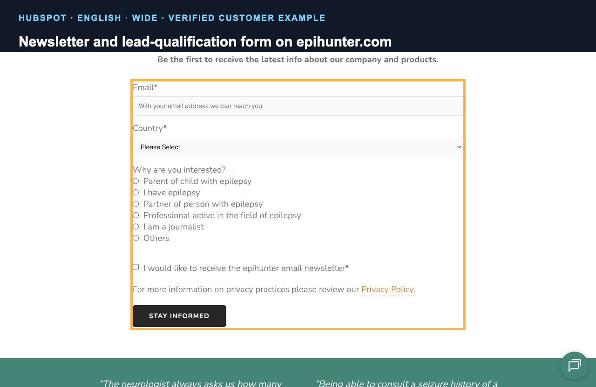

HubSpot is not the next step for every Squarespace contact form. It becomes useful when an enquiry starts a sales process that somebody actually manages.

That normally means leads have owners, stages, follow-up tasks or several marketing sources. If every message goes to one inbox and receives one reply, adding a CRM may create more administration than value.

HubSpot was publicly detectable on 22 of the 674 Multilingualizer customers with a reachable site, or 3.3%. Ten of those customers were in technology and software. That concentration makes sense: the commercial case is strongest where a multilingual enquiry can become a longer sales conversation.

**Affiliate disclosure:** I intend to use HubSpot affiliate links in this guide after the account and click tracking are configured. If you buy through one, I may earn a commission. You pay the same price either way.

## Decide what the CRM needs to know

Before installing anything, define the minimum information needed to handle a lead:

- contact name and reply details
- enquiry type
- website language
- source page
- campaign or referral source
- consent choices where applicable
- sales owner or team

Website language and source page should be stored as data, not buried in a notification email. They let the sales team reply in the right language and show which translated pages produce useful enquiries.

## Add HubSpot tracking to Squarespace

HubSpot's current documentation says an externally hosted site needs the HubSpot tracking code if you want page views and related visitor activity recorded in HubSpot. The code is also relevant to some non-HubSpot form and chat features.

The Squarespace route is normally site-wide code injection:

1. Copy the tracking code from the HubSpot account settings.
2. Add it to the appropriate Squarespace code-injection area.
3. Publish and open the public site while signed out.
4. Verify the tracking code using HubSpot's own check and the browser network panel.
5. Test after accepting and rejecting the site's consent choices.

Do not judge the installation only by viewing page source. A consent platform may correctly delay the request until consent, while an ad blocker may suppress it entirely.

## Use one deliberate form-language strategy

There are two sensible approaches.

### Separate form for each language

Create and review one form per language. This gives precise control over labels, help text, validation messages, consent copy and follow-up content.

It also creates maintenance work. When a field or legal statement changes, update every language version.

### HubSpot's form-language and translation features

HubSpot forms have a primary language setting. HubSpot also documents AI-assisted form translation for certain Professional and Enterprise subscriptions.

Check the current subscription requirement before designing around it. Automatic output still needs review by somebody who understands the language and the business context.

Whichever route you use, pass the page language into a dedicated HubSpot property. Do not try to reconstruct it later from the visitor's country.

## A live English and Dutch form example

Epihunter uses a HubSpot newsletter and lead-qualification form on its public site.

The English form asks for an email address, country and reason for interest. The separate Dutch page has a corresponding Dutch form with labels including `Land`, `Waarom ben je geïnteresseerd?` and `Blijf op de hoogte`.

This is the deliberate version of a multilingual embed: the page route and form language agree. It was publicly verified on 21 August 2026. The screenshot proves the visible implementation, not the business's HubSpot subscription, lead volume or results.

## Embed the form in Squarespace

The normal route is to copy HubSpot's embed code into a Squarespace Code Block on the target page.

After publishing, test:

1. a valid submission in every language
2. required-field and invalid-email messages
3. the thank-you message or redirect
4. the resulting contact properties in HubSpot
5. internal notifications and lead ownership
6. mobile width, keyboard navigation and error focus

Submit test records that are clearly labelled and delete them afterwards if they are not needed.

## The Squarespace AJAX problem

HubSpot's troubleshooting documentation specifically identifies Squarespace AJAX loading as a reason an externally embedded form can appear on the first page load but fail after navigating between pages.

The useful test is simple:

1. open a different page on the public site
2. navigate internally to the form page without reloading the browser tab
3. confirm the form appears and submits
4. repeat in each language and on mobile

If it fails only after internal navigation, you have reproduced the lifecycle problem. Follow HubSpot's current Squarespace guidance for the affected template and configuration rather than adding several copies of the embed script blindly.

## Keep consent and language separate

Language choice is not consent. A visitor can choose French and still reject analytics or marketing storage.

Map these as separate fields and behaviours:

| Item | Purpose |
|---|---|
| Page language | Reply and content language |
| Source page | Which service or offer produced the enquiry |
| Analytics consent | Whether non-essential measurement can run |
| Marketing consent | Whether the contact can receive relevant marketing |
| Form submission | The enquiry the visitor explicitly sent |

Configure the CRM and consent platform against the rules that apply to the business. This guide explains the technical separation, not the legal basis for a particular implementation.

## When HubSpot is worth considering

HubSpot has a practical role when the business:

- receives leads from several languages or markets
- needs a shared pipeline rather than one inbox
- assigns leads to different people
- runs follow-up sequences or measures lead sources
- can maintain the fields, workflows and consent configuration

It is probably premature when the site receives a handful of simple enquiries and nobody will keep the CRM current.

## Where Multilingualizer fits

HubSpot manages the contact and sales process. It does not translate the surrounding Squarespace page.

[Our very own Multilingualizer](/product/multilingualizer/) works directly inside the Squarespace editor, so you stay in control of the translated page copy and there are no monthly translation fees. Use a separate HubSpot form per language, or a verified HubSpot translation workflow, for the embedded form itself.

## Sources and publication note

- [Install the HubSpot tracking code](https://knowledge.hubspot.com/reports/install-the-hubspot-tracking-code)
- [Create and edit HubSpot forms](https://knowledge.hubspot.com/forms/create-and-edit-forms)
- [Set up a HubSpot form on an external site](https://knowledge.hubspot.com/forms/set-up-and-style-your-form-on-an-external-site)
- [Troubleshoot externally embedded HubSpot forms](https://knowledge.hubspot.com/forms/why-doesn-t-my-externally-embedded-hubspot-form-work)
- [Public HubSpot form example on Epihunter](https://www.epihunter.com/)

This is an editorial draft. The current embed, consent behaviour and internal-navigation test need to be reproduced on a controlled Squarespace site before publication. HubSpot subscription requirements and affiliate terms must be checked again on publication day.
